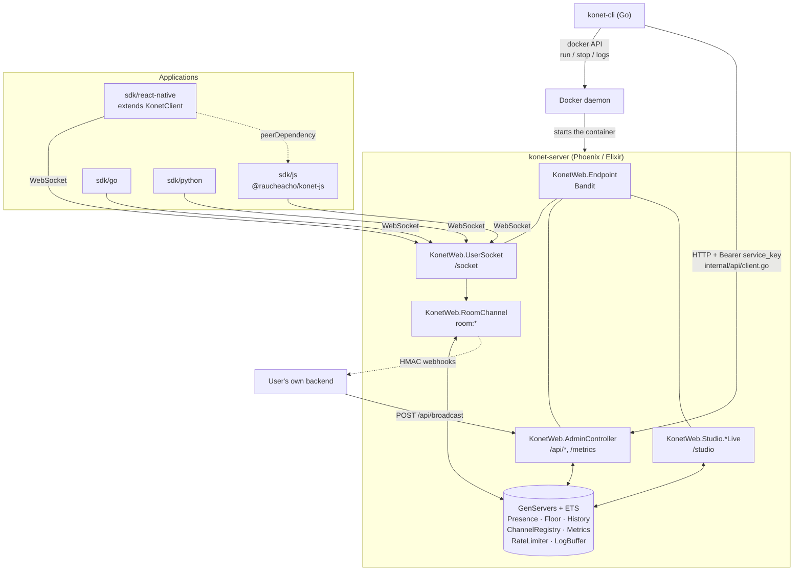
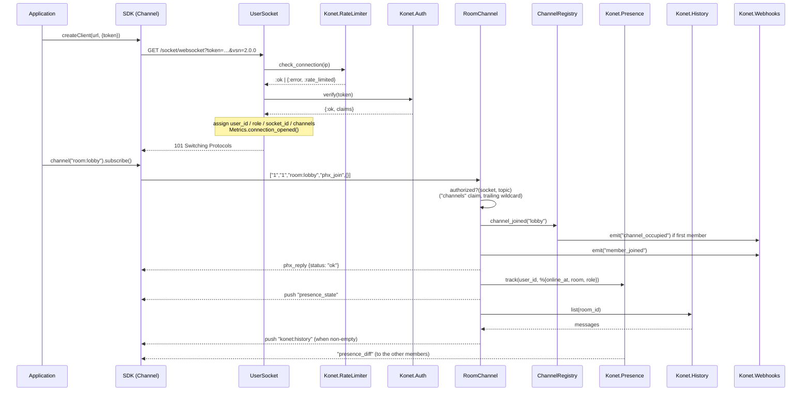

# 00 — Monorepo overview

## The pieces

```
konet/
├── konet-server/       realtime engine — Phoenix / Elixir
├── konet-cli/          local-dev CLI — Go + Cobra
├── sdk/
│   ├── go/             Go client        (github.com/raucheacho/konet/sdk/go)
│   ├── js/             JS/TS client     (@raucheacho/konet-js)  ← reference implementation
│   ├── react-native/   RN wrapper       (@raucheacho/konet-rn)
│   └── python/         asyncio client   (konet, on PyPI)
├── examples/live-room/ multiplayer demo: Vite front-end + Python agent
├── docs/               public Nextra site — DO NOT TOUCH from docs-internal
├── docs-internal/      this folder
├── docker-compose.yml  self-hosted deployment
└── .github/workflows/  CI + 6 release workflows
```

### `konet-server` — the only component that holds state

A Phoenix application with no database. All state lives in memory, in ETS tables
owned by GenServers, all started from `Konet.Application.start/2`
(`konet-server/lib/konet/application.ex`):

| Process | Role | ETS table |
|---|---|---|
| `Phoenix.PubSub` (`Konet.PubSub`) | internal broadcast bus | — |
| `Konet.Presence` | Phoenix presence (who is online) | internal to Phoenix.Presence |
| `Konet.Metrics` | connection/message counters, per-second rate | — (struct) |
| `Konet.ChannelRegistry` | subscriber count per room | `:konet_channels` |
| `Konet.RateLimiter` | connection / message / binary-frame quotas | `:konet_rl` |
| `Konet.Floor` | exclusive speaking rights (floor control) | `:konet_floor` |
| `Konet.LogBuffer` | last 100 events for the Studio Logs page | — (list) |
| `Konet.History` | replay of the last N broadcasts per room | `:konet_history` |
| `Task.Supervisor` (`Konet.TaskSupervisor`) | fire-and-forget webhook delivery | — |
| `KonetWeb.Telemetry` | telemetry poller | — |
| `KonetWeb.Endpoint` | HTTP + WebSocket (Bandit) | — |

**Direct consequence:** restarting the container wipes presence, history, floors
and Studio logs. That is deliberate — see
[02-konet-server/00-architecture.md](02-konet-server/00-architecture.md).

### `konet-cli` — local development only

A Go binary (`konet`) that drives **one local Docker container** named
`konet-server` (`konet-cli/internal/docker/docker.go`, constant
`ContainerName`). It cannot deploy to a VPS, and that is not its job: the model
is the Supabase CLI — `konet init` / `keys generate` / `start` / `studio` for
development, and docker-compose or Coolify/Dokploy for production.

Its configuration is a `konet.config.toml` file written into the current
directory (`konet-cli/internal/config/config.go`).

### `sdk/` — four clients, one protocol

Every SDK speaks **Phoenix Channels v2** directly, without depending on
Phoenix's own JS library. Each one reimplements:

- the text frame `[join_ref, ref, topic, event, payload]`;
- the binary framing of `Phoenix.Socket.V2.JSONSerializer` (see
  [04-sdk/README.md](04-sdk/README.md#the-shared-contract));
- the heartbeat on the `"phoenix"` topic.

`sdk/js` is the reference implementation (the most complete: reconnection,
re-join, zombie-socket detection). `sdk/react-native` **implements none of the
protocol**: it is a `KonetNativeClient` subclass listening to `AppState`, plus
re-exports. `sdk/go` and `sdk/python` are independent ports, noticeably less
advanced on reconnection.

### `examples/live-room` — the end-to-end demo

- `web/`: a vanilla-JS Vite front-end consuming the **local** JS SDK through
  `"@raucheacho/konet-js": "file:../../../sdk/js"`. Cursors, presence,
  reactions, chat.
- `agent/`: `agent.py` spawns N bots (default `AGENT_COUNT=50`) that all join
  the same `room:live-room` through the Python SDK. It doubles as the server
  stress-test tool (it prints `msg/s` every 2 s).

The point of the demo is that a Konet channel is *cross-runtime*: a JS
front-end and a Python backend share one room with no shared code.

## How the pieces fit together



### Who depends on whom, concretely

| Dependency | Nature | Where it is declared |
|---|---|---|
| `sdk/react-native` → `sdk/js` | `peerDependencies: ">=0.3.0"`, resolved locally via `tsconfig.json` `paths` and the vitest alias | `sdk/react-native/package.json`, `tsconfig.json`, `vitest.config.ts` |
| `examples/live-room/web` → `sdk/js` | `file:../../../sdk/js` | `examples/live-room/web/package.json` |
| `examples/live-room/agent` → `sdk/python` | `konet>=0.1.4` (PyPI, or `pip install -e ../../../sdk/python`) | `examples/live-room/agent/pyproject.toml` |
| `konet-cli` → `konet-server` | Docker image `ghcr.io/raucheacho/konet:latest` + HTTP `/api/*` | `konet-cli/internal/docker/docker.go`, `internal/api/client.go` |
| SDKs → server | Phoenix Channels v2 protocol, **no shared code** | deliberately duplicated in each `binary.{ts,go,py}` |

There is **no build-time dependency** between `konet-server` and anything else:
the server neither compiles nor tests the SDKs, and vice versa. The only
coupling point is the protocol, checked by parallel test suites (see
[04-sdk/README.md](04-sdk/README.md)).

## Reference flow: a client joins a room



## Why Phoenix / Elixir for the server

The requirement is: tens of thousands of open sockets, most of them idle, on a
modest VPS, with no database.

- **One BEAM process per connection, at roughly 2 KB.** That is precisely the
  model long, mostly-silent sockets demand. The `agent.py` stress test spawns
  hundreds of bots on a laptop for exactly this reason.
- **Process isolation.** A client sending a malformed frame crashes *its own*
  channel process, not the server. The pattern shows in
  `RoomChannel.handle_in/3`: the final catch-all clause exists because a
  `FunctionClauseError` used to kill the channel and drop the client's
  connection (see the comment in
  `konet-server/lib/konet_web/room_channel.ex`).
- **`Phoenix.Channel` + `Phoenix.Presence` + `Phoenix.PubSub` already provide
  99 % of the product.** Konet essentially only writes auth, quotas, floor
  control, history and the Studio. Presence CRDT, binary fastlane, heartbeat and
  longpoll fallback all come for free.
- **The binary fastlane.** `broadcast!(socket, event, {:binary, data})` encodes
  the frame once and writes it into every subscribed socket without going
  through their channel processes. That is what makes push-to-talk voice
  viable — a hand-rolled equivalent in Node or Go would pay one encode per
  recipient.
- **LiveView for the Studio.** A realtime dashboard with no separate front-end,
  no JS build and no API to maintain: it subscribes to the same PubSub topics as
  everything else (`"studio:metrics"`, `"studio:channels"`, `"studio:logs"`).

The accepted trade-off is a single node. Nothing in the code forms a BEAM
cluster, so `Phoenix.PubSub` stays local and the ETS state is not replicated.
Konet does not scale horizontally today — see
[06-known-issues.md](06-known-issues.md).

## Why Go for the CLI

- **A single static binary, no runtime.** `CGO_ENABLED=0` in
  `konet-cli/.goreleaser.yaml`: users install `konet` through Homebrew or Scoop
  and need neither Elixir, nor Node, nor Python. Shipping the CLI in Elixir
  would have forced the BEAM on someone who just wants `konet start`.
- **The Docker SDK is native Go.** `github.com/docker/docker/client` is *the*
  reference library; the CLI talks to the Docker daemon over its socket rather
  than shelling out to `docker run`.
- **Cobra gives the expected ergonomics** (subcommands, `--help`, flags) for
  free, and **GoReleaser** turns one tag into 6 binaries plus the Homebrew cask
  and the Scoop bucket.

Go and Elixir therefore sit on a clean boundary: Go for what is *shipped to the
user as a tool*, Elixir for what *runs and holds state*.
