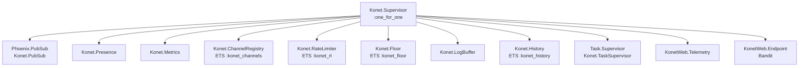
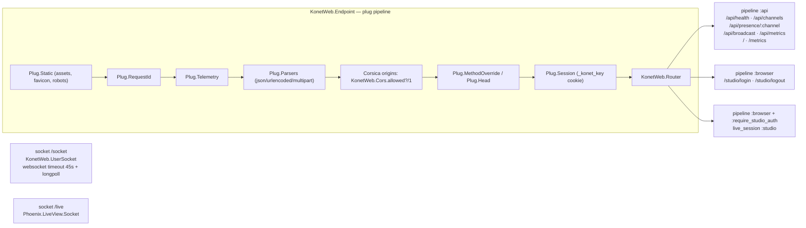

# 02.0 — Phoenix architecture

## Module layout

Konet does **not** use the usual "contexts" layout of a `mix phx.new` app —
there is no Ecto, no schema, no repo. The split is instead:

```
lib/
├── konet/                     domain: stateful processes, no web concerns
│   ├── application.ex         supervision tree
│   ├── auth.ex                JWT sign/verify, Studio password, rotate!
│   ├── channel_registry.ex    GenServer + ETS :konet_channels — subscribers per room
│   ├── floor.ex               GenServer + ETS :konet_floor — exclusive speaking rights
│   ├── history.ex             GenServer + ETS :konet_history — replay buffer
│   ├── log_buffer.ex          GenServer — last 100 Studio log entries
│   ├── metrics.ex             GenServer — connections, messages, per-second rate
│   ├── presence.ex            `use Phoenix.Presence` (5 lines)
│   ├── rate_limiter.ex        GenServer + ETS :konet_rl — three independent budgets
│   └── webhooks.ex            fire-and-forget HTTP POST via :httpc
└── konet_web/                 web: everything that speaks HTTP or WebSocket
    ├── endpoint.ex            plug pipeline, socket mounts
    ├── router.ex              /api, /studio, /, /metrics
    ├── user_socket.ex         WebSocket handshake: rate limit + JWT
    ├── room_channel.ex        the whole channel protocol — the heart of the server
    ├── telemetry.ex           telemetry_poller supervisor + metric definitions
    ├── controllers/
    │   ├── admin_controller.ex        /api/* + /metrics (Prometheus)
    │   ├── studio_auth_controller.ex  /studio/login (server-rendered HTML string)
    │   ├── error_html.ex / error_json.ex
    ├── live/studio/           7 LiveViews + the on_mount auth hook
    └── components/            layouts (root/app/studio) + StudioComponents
```

`KonetWeb` (`lib/konet_web.ex`) is the standard `__using__` module providing
`:router`, `:controller`, `:live_view`, `:html` and `verified_routes`.

## Supervision tree

`Konet.Application.start/2` uses `strategy: :one_for_one`, so a crashed
GenServer restarts alone. Order matters in one place: `KonetWeb.Endpoint` is
last, so no socket can be accepted before the ETS tables exist.



⚠️ **Fragile — every ETS table is owned by its GenServer.** They are created
with `:named_table, :public` inside `init/1`, so if a GenServer crashes, its
table is destroyed and recreated **empty** by the restart. For `RateLimiter`
that is harmless (counters reset). For `Floor` it silently frees every held
floor; for `ChannelRegistry` the Studio's channel list empties while sockets are
still connected and never recovers, because counts are only incremented on join.

## The three entry paths



1. **`/socket`** — application clients. `websocket: [timeout: 45_000]` is the
   number every SDK heartbeat is tuned against: the JS client defaults to a
   30 s heartbeat interval with a 10 s reply deadline, both comfortably under
   45 s. `longpoll: true` is enabled as a fallback but no SDK uses it.
2. **`/api/*` and `/metrics`** — server-to-server. All routes except
   `/api/health` and `/` require `Authorization: Bearer <service_key>`.
3. **`/studio`** — the LiveView dashboard, over `/live`.

**CORS and the WebSocket origin check read the same list.** They used to
disagree — `check_origin` honoured `KONET_ALLOWED_ORIGINS` while
`plug Corsica, origins: "*"` was hardcoded, so locking the variable down
restricted upgrades and left the REST API open to every origin. Corsica now
delegates to `KonetWeb.Cors.allowed?/1`, which reads the same parsed list
(`test/konet_web/cors_test.exs`). Unset or `"*"` still means open, matching
`check_origin: false`.

## Configuration layering

```
config/config.exs      compile-time defaults for all envs (endpoint, esbuild, logger)
  ├── config/dev.exs   port 4000, check_origin false, esbuild watcher, dev secrets
  ├── config/test.exs  server: false, port 4002, fixed test jwt_secret
  └── config/prod.exs  logger :info, serve_endpoints true
config/runtime.exs     read at boot — every KONET_* env var
```

`runtime.exs` has two independent blocks, `config_env() == :prod` and
`config_env() == :dev`. They are near-duplicates and drift is easy: `KONET_HOST`,
`KONET_PORT`, `KONET_ANON_KEY`, `KONET_SERVICE_KEY` and `KONET_ALLOWED_ORIGINS`
exist **only** in the prod block.

The dev block carries a workaround worth knowing about (added in commit
`0ce1785`, "Honorer KONET_JWT_SECRET en dev"):

```elixir
if secret = System.get_env("KONET_JWT_SECRET") do
  config :konet, jwt_secret: secret
end
```

Without it, running the server from source against a backend minting its own
tokens refused every connection with nothing but `REFUSED CONNECTION` in the
logs — a long way from "the secrets differ".

## Reading configuration at runtime

Everything goes through `Application.get_env(:konet, …)` with an inline default,
never through a module attribute. That is what lets `Konet.Auth.rotate!/0` and
the tests swap values with `Application.put_env/3` at runtime:

| Key | Default in code | Read by |
|---|---|---|
| `:jwt_secret` | `"change-me-in-production-min-32-chars!!"` | `Konet.Auth` |
| `:anon_key` / `:service_key` | `nil` | `Studio.KeysLive` |
| `:studio_password` | `nil` | `Konet.Auth.studio_auth_enabled?/0` |
| `:rate_limit_messages` | `60` | `Konet.RateLimiter` |
| `:rate_limit_connections` | `200` | `Konet.RateLimiter` |
| `:rate_limit_binary` | `120` | `Konet.RateLimiter` |
| `:floor_max_hold_ms` | `30_000` | `Konet.Floor` |
| `:history_limit` | `0` | `Konet.History` |
| `:history_ttl_seconds` | `900` | `Konet.History` sweep |
| `:allowed_origins` | `nil` (open) | `KonetWeb.Cors`, and `check_origin` |
| `:trust_proxy_headers` | `false` | `KonetWeb.UserSocket.extract_ip/1` |
| `:log_broadcasts` | `true` | `RoomChannel.handle_in("broadcast", …)` |
| `:webhook_url` / `:webhook_secret` | `nil` | `Konet.Webhooks` |

⚠️ Note the default `jwt_secret` is a real, usable string. In `:prod`,
`runtime.exs` raises when `KONET_JWT_SECRET` is missing, so it cannot be reached
there — but a `MIX_ENV=dev` server exposed to the internet would accept tokens
signed with a value that is published in this repo.

## No database, on purpose

There is no Ecto dependency in `mix.exs`. Everything that would normally be a
table is an ETS entry with an explicit lifetime:

| State | Lost on restart? | Bounded by |
|---|---|---|
| Presence | yes | live socket count |
| `ChannelRegistry` counts | yes | one row per active room |
| `History` | yes | `KONET_HISTORY_LIMIT` entries per room |
| `Floor` | yes | one row per topic, swept after `KONET_FLOOR_MAX_HOLD_MS` |
| `LogBuffer` | yes | 100 entries |
| `RateLimiter` | yes | wiped wholesale every 120 s |
| Keys / secrets | yes if rotated in the Studio | — |

**`Konet.History` evicts on age, not on occupancy.** A sweep every 60 s drops
rooms whose last write is older than `KONET_HISTORY_TTL` (default 900 s), which
bounds the table for workloads that mint many short-lived room names. Eviction
is deliberately *not* tied to the room emptying: outliving the last member is the
entire point of the buffer, since that is exactly what a late joiner came for.
`ChannelRegistry` does delete its row on the last leave, because a subscriber
count means nothing without subscribers.
