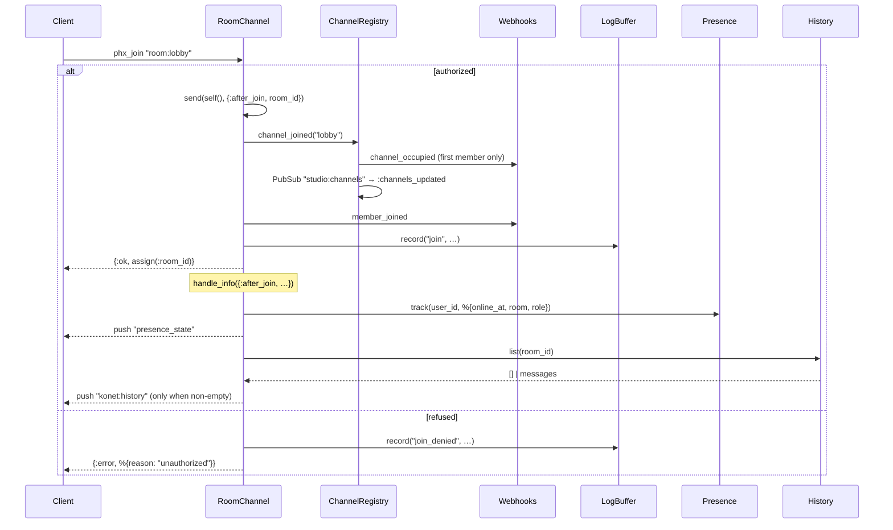

# 02.1 — Channels, presence, broadcast, history

Everything in this page lives in `lib/konet_web/user_socket.ex` and
`lib/konet_web/room_channel.ex`.

## The socket handshake

`KonetWeb.UserSocket.connect/3` is deliberately strict and short:

```elixir
def connect(%{"token" => token}, socket, connect_info) do
  ip = extract_ip(connect_info)
  with :ok <- Konet.RateLimiter.check_connection(ip),
       {:ok, claims} <- Konet.Auth.verify(token) do
    …
  else
    {:error, :rate_limited} -> {:error, %{reason: "rate_limited"}}
    _ -> {:error, %{reason: "unauthorized"}}
  end
end
def connect(_params, _socket, _connect_info), do: {:error, %{reason: "token_required"}}
```

Order is intentional: the IP quota is checked *before* the signature, so a flood
of garbage tokens is cheap to refuse.

Assigns set on success — every one of them is used later:

| Assign | Source | Used by |
|---|---|---|
| `:user_id` | claim `sub`, else `"anon_" <> socket_id` | presence key, floor holder, webhooks, logs |
| `:role` | claim `role`, else `"anon"` | presence metadata only |
| `:socket_id` | 16 random bytes, hex | rate-limiter bucket key, `UserSocket.id/1` |
| `:channels` | claim `channels` (may be `nil`) | `RoomChannel.authorized?/2` |

`UserSocket.id/1` returns `"user_socket:#{socket_id}"`, which is what would let
an operator disconnect a single socket via `Endpoint.broadcast(id, "disconnect", %{})`.
Nothing in the codebase uses that today.

**`extract_ip/1` and reverse proxies.** Behind a proxy every connection carries
the proxy's IP, which would turn `KONET_CONN_RATE_LIMIT` into a single global
budget. `extract_ip/1` therefore reads the leftmost `X-Forwarded-For` entry —
but **only** when `KONET_TRUST_PROXY_HEADERS=true`. The gate is not paranoia:
trusting the header unconditionally lets a directly-connected client forge an IP
and mint itself a private budget, which is strictly worse than not reading it.
Set it wherever a proxy terminates TLS (Coolify, Dokploy, Traefik, Nginx), leave
it off otherwise. Covered by `test/konet_web/user_socket_test.exs`.

## Topic shape

`UserSocket` declares exactly one channel route:

```elixir
channel "room:*", KonetWeb.RoomChannel
```

`RoomChannel.join/2` matches `"room:" <> room_id`, so `room_id` is everything
after the first colon — including further colons. `"room:user-42:inbox"` yields
`room_id = "user-42:inbox"`. That is what makes namespaces like
`"room:tenant-7:*"` work in the `channels` claim.

Note the two identifiers that coexist and are easy to confuse:

- **`socket.topic`** — the full `"room:lobby"`. Used as the `Konet.Floor` key.
- **`socket.assigns.room_id`** — the suffix `"lobby"`. Used by
  `ChannelRegistry`, `History`, webhooks, and the Studio.

`AdminController.broadcast/2` and `Studio.BroadcastLive` both re-add the prefix
(`Endpoint.broadcast("room:#{channel}", …)`) while recording history under the
bare name, which keeps the two consistent.

## Authorization on join

```elixir
defp authorized?(socket, topic) do
  case socket.assigns[:channels] do
    allowed when is_list(allowed) -> Enum.any?(allowed, &topic_allowed?(&1, topic))
    _ -> true
  end
end

defp topic_allowed?(pattern, topic) when is_binary(pattern) do
  case String.split(pattern, "*", parts: 2) do
    [^topic]        -> true                              # exact match
    [prefix, ""]    -> String.starts_with?(topic, prefix) # trailing wildcard
    _               -> false
  end
end
```

Semantics, and why:

- **No `channels` claim → any room.** The shared anon/service keys carry no such
  claim, so this preserves the original behaviour and keeps existing
  deployments working.
- **A `channels` claim → allow-list.** The developer's own backend mints the
  token with `jwt_secret`, so the list is unforgeable.
- **Only a *trailing* `*` matters.** `"room:a*b"` splits into `["room:a", "b"]`,
  which matches neither branch and is refused. A pattern with an interior
  wildcard silently allows nothing.

Covered by `test/konet_web/room_channel_test.exs`, `describe "join authorization"`.

## The join sequence



The `send(self(), {:after_join, …})` indirection is the standard Phoenix
pattern: presence tracking has to happen *after* the join reply, or the client
would receive a `presence_diff` for itself before it knows it joined.

## Presence

`Konet.Presence` is five lines — `use Phoenix.Presence, otp_app: :konet,
pubsub_server: Konet.PubSub`. Konet adds nothing to it.

Metadata is **fixed server-side**:

```elixir
Presence.track(socket, socket.assigns.user_id, %{
  online_at: System.system_time(:second),
  room: room_id,
  role: socket.assigns.role
})
```

There is no way for a client to attach its own presence metadata (display name,
avatar, colour). That is a real design constraint, not an oversight, and
`examples/live-room` shows the intended workaround: identity travels inside
broadcast payloads, and each client ignores the echo of its own messages. It is
documented in `examples/live-room/README.md` and in the header comment of
`examples/live-room/web/src/main.js`.

Clients receive presence through two events they must both handle:
`presence_state` (full snapshot, pushed once after join) and `presence_diff`
(sent by Phoenix afterwards). Every SDK folds both into a local map — see
`sdk/js/src/presence.ts`, the only SDK with a dedicated presence module.

## Broadcast

```elixir
def handle_in("broadcast", %{"event" => event, "payload" => payload}, socket) do
  case RateLimiter.check_message(socket.assigns.socket_id) do
    :ok ->
      Metrics.message_sent()
      Konet.History.record(socket.assigns.room_id, event, payload)
      if log_broadcasts?(), do: log_event("broadcast", %{room: …, event: event})
      broadcast!(socket, event, payload)
      {:noreply, socket}
    {:error, :rate_limited} ->
      {:reply, {:error, %{reason: "rate_limited"}}, socket}
  end
end
```

Two properties every SDK is built around:

1. **An accepted broadcast is never acknowledged.** `{:noreply, …}` — there is
   no `phx_reply`. Only a *refusal* produces one. That is why `sdk/js`'s
   `Channel.trackSend` drops its tracker after a 10 s grace period
   (`SEND_REPLY_GRACE_MS`) rather than waiting forever, and why `send()` is
   fire-and-forget in every SDK.
2. **`broadcast!` echoes back to the sender.** Phoenix delivers a broadcast to
   every subscriber including its author. The live-room demo filters its own
   messages by a client-generated id. (Binary frames are the exception — see
   [02-binary-and-floor.md](02-binary-and-floor.md).)

Also note that `Metrics.message_sent()` counts *one* message per broadcast, not
one per recipient — `msg/s` in the Studio is an ingress rate, not egress.

⚠️ **`log_event("broadcast", …)` is on the hot path.** Every accepted broadcast
writes to `Konet.LogBuffer`, which is a `GenServer.cast` plus a
`Phoenix.PubSub.broadcast` to `"studio:logs"`. Under the `agent.py` stress test
that single GenServer becomes the serialization point for the whole server.

It is gated behind `KONET_LOG_BROADCASTS`, default `true` — the Studio Logs page
is most of its value. Set it to `false` for high-throughput deployments; the
low-rate join/leave and floor entries are unaffected. The binary path never logs
at all.

## History replay

`Konet.History` (`lib/konet/history.ex`) is off by default
(`KONET_HISTORY_LIMIT=0`) and explicitly not durable storage. It exists for one
scenario: an agent or backend broadcasts into an empty room, and a client
connecting seconds later still sees it.

- Written from three places: `RoomChannel.handle_in("broadcast", …)`,
  `AdminController.broadcast/2`, `Studio.BroadcastLive`.
- Read once, in `handle_info({:after_join, …})`, and pushed as a single
  `konet:history` event carrying `%{messages: [...]}`, oldest first.
- Entries are `%{event, payload, timestamp}` with an ISO-8601 timestamp.
- Binary frames are **never** recorded (50 frames/s would blow up the table for
  a replay nobody can use).

## The catch-all `handle_in/3`

```elixir
def handle_in(event, payload, socket) do
  log_event("unhandled_in", %{room: socket.assigns[:room_id], event: event})
  {:reply, {:error, %{reason: unsupported_reason(payload), event: event}}, socket}
end
```

This clause is load-bearing. Before it existed, a typo'd event name, a malformed
`"broadcast"` payload, or a binary frame arriving where no clause matched raised
`FunctionClauseError`, which took the channel process down and dropped the
client's connection. Two tests pin the behaviour
(`describe "unsupported input"`), including the assertion that the channel is
still usable afterwards.

`unsupported_reason/1` currently ignores its argument and always returns
`"unsupported_event"` — it is a seam left for finer-grained reasons.

## `terminate/2`

```elixir
def terminate(_reason, socket) do
  user_id = socket.assigns.user_id
  if socket.assigns[:room_id] && Konet.Floor.release(socket.topic, user_id) == :ok do
    broadcast!(socket, "konet:floor", %{holder: nil, since: now_ms()})
  end
  ChannelRegistry.channel_left(socket.assigns[:room_id] || "unknown")
  Konet.Webhooks.emit("member_left", …)
  log_event("leave", …)
  :ok
end
```

**No connection counting here.** `terminate/2` runs once per *channel*, so
pairing it with the per-*socket* increment in `UserSocket` made the gauge
decrement three times for a client in three rooms — it drifted to zero on any
multi-channel workload, in the Studio tile, `/metrics`, `/api/health` and
`konet status` at once. `Konet.Metrics` now monitors the socket process instead,
which cannot drift. `test/konet/metrics_test.exs` pins it.

⚠️ **`ChannelRegistry.channel_left("unknown")`** is called when a channel dies
before assigning `:room_id`. `handle_cast({:left, …})` finds no row and no-ops,
so nothing breaks, but the fallback string is a smell.
