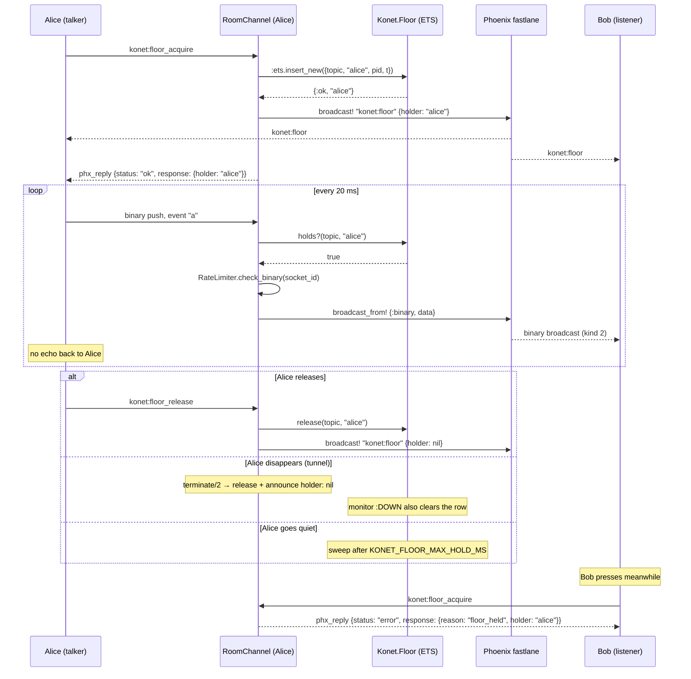

# 02.2 — Binary frames and floor control

Added in commits `3975f19` and `61ce7d9` ("Trames binaires et parole
exclusive"). Two features that only make sense together: the binary path is the
transport, the floor is the arbiter that says who may use it.

## Why they exist

The target workload is half-duplex media — push-to-talk, a radio net, a
turn-based game — where the point is that a **second sender must be told no**
rather than mixed in. Konet stays generic: it arbitrates who may send, it does
not know what is being sent. Nothing in the server mentions audio, Opus or
codecs.

## `Konet.Floor`

`lib/konet/floor.ex`. One ETS row per topic: `{topic, user_id, pid, since_ms}`.

Two properties are handled here rather than by callers:

**Acquisition is atomic.** `:ets.insert_new/2` is a compare-and-swap, and the
ETS table is the only authority. Two clients pressing in the same millisecond
resolve to exactly one winner without a GenServer round trip.

```elixir
def acquire(topic, user_id, pid \\ self()) do
  entry = {topic, user_id, pid, now_ms()}
  if :ets.insert_new(@table, entry) do
    GenServer.cast(__MODULE__, {:monitor, topic, pid})
    {:ok, user_id}
  else
    case holder(topic) do
      ^user_id -> {:ok, user_id}          # duplicate press: harmless
      nil      -> acquire(topic, user_id, pid)  # released between the two calls
      other    -> {:error, {:held, other}}
    end
  end
end
```

**The floor is always released**, through three independent mechanisms:

1. `RoomChannel.terminate/2` calls `Floor.release/2` explicitly and announces
   `konet:floor` with `holder: nil`, so other clients stop showing someone as
   talking.
2. `Konet.Floor` monitors the holder's pid. On `:DOWN` it clears the row with
   `:ets.match_delete(@table, {topic, :_, pid, :_})` — matching on the pid too,
   because by then the topic may legitimately belong to someone else.
3. A sweep every 5 s deletes any row older than `KONET_FLOOR_MAX_HOLD_MS`
   (default 30 s), for a holder who simply stops talking without releasing.

`release/2` is holder-checked: a late release from a previous holder must not
cut off whoever is talking now.

**Retries are bounded.** The retry taken when a holder releases between the
`insert_new` and the read is capped at `@max_acquire_attempts` (5), after which
`acquire` reports the current holder. Unbounded recursion there could in
principle spin forever under contention.

**Two clocks, both deliberate.** Each row stores a monotonic timestamp *and* a
wall-clock one, because they answer different questions: the sweep measures
elapsed hold time against the monotonic value, and the wire carries the
wall-clock one, since a client cannot interpret this node's monotonic clock.
`acquire/3` returns `{:ok, holder, since_wall}` and `RoomChannel` broadcasts that
value rather than "now" — so a duplicate press reports the *original* moment,
which is what a listener joining mid-stream needs to show how long someone has
been talking.

**One monitor per topic, dropped on release.** `release/2` and the sweep both
cast a `:demonitor`, and re-acquiring replaces the previous holder's monitor.
Before that, a channel pressing and releasing repeatedly accumulated one monitor
per press on its own pid.

## Floor protocol

Two client events, one server broadcast.

| Direction | Event | Payload | Reply |
|---|---|---|---|
| client → server | `konet:floor_acquire` | `{}` | `{:ok, %{holder: user_id}}` or `{:error, %{reason: "floor_held", holder: other}}` |
| client → server | `konet:floor_release` | `{}` | `:ok` or `{:error, %{reason: "not_holder"}}` |
| server → all | `konet:floor` | `%{holder: user_id \| nil, since: ms}` | — |

The `konet:floor` broadcast goes to **everyone including the holder**: subscribers
need to know a stream is starting before its first frame arrives, and the holder
needs the same id to stamp its frames with.

## The binary hot path

```elixir
def handle_in(event, {:binary, data}, socket) do
  if Konet.Floor.holds?(socket.topic, socket.assigns.user_id) do
    case RateLimiter.check_binary(socket.assigns.socket_id) do
      :ok ->
        Metrics.message_sent()
        broadcast_from!(socket, event, {:binary, data})
        {:noreply, socket}
      {:error, :rate_limited} ->
        {:reply, {:error, %{reason: "rate_limited"}}, socket}
    end
  else
    {:reply, {:error, %{reason: "floor_required"}}, socket}
  end
end
```

At 20 ms frames this runs 50 times a second per talker, so it does the least
possible. Three things are deliberately **absent**, each for a stated reason
(the comment block above the clause in `room_channel.ex` is the canonical
version):

- **No history recording** — buffering 50 frames a second would blow up the ETS
  table for a replay nobody can use. Recording audio is a durable-storage
  problem, not a replay-buffer one.
- **No per-frame logging** — this is exactly the hot-path `LogBuffer` write that
  the text path still does, and audio is where it would first hurt.
- **`broadcast_from!`, not `broadcast!`** — sending a talker their own audio back
  is echo, and on a phone it is echo at speaker volume. Pinned by the test
  `"audio is not fed back to the talker"`, which uses `refute_push`.

`broadcast!` with a `{:binary, _}` payload takes Phoenix's **fastlane**: the
frame is encoded once and written to every subscriber's socket without passing
through their channel processes. This is the single biggest reason the server is
Phoenix.

## Binary frames get their own rate budget

`Konet.RateLimiter.check_binary/1` uses key `"bin:#{socket_id}:#{second}"`,
separate from `"msg:…"`. Rationale, from `rate_limiter.ex`:

> Binary frames arrive at a media rate, not a message rate: 20 ms Opus frames
> are 50 per second on their own, and sharing the message budget would have a
> talker starve their own position updates. The floor already allows one sender
> per topic, so this is a backstop against a single flooding client, not the
> primary control.

Default `KONET_RATE_LIMIT_BINARY=120`.

## Wire format

The framing is Phoenix's, transcribed from `Phoenix.Socket.V2.JSONSerializer`.
Three shapes, told apart by the first byte:

```
push      0 | join_ref_size | ref_size | topic_size | event_size | … | data
reply     1 | join_ref_size | ref_size | topic_size | status_size | … | data
broadcast 2 | topic_size    | event_size | topic | event | data
```

Every size is one byte, so each field is capped at 255 — checked on encode,
because a silently truncated topic would deliver audio to the wrong room.

The asymmetry is Phoenix's, not Konet's: a **client** push carries a `ref`, a
**server** push does not, and a broadcast carries neither `ref` nor `join_ref`.
That is why every SDK names its decoder `decodeServerFrame` /
`decode_server_frame` / `decodeServerBinaryFrame` — the output of `encodePush`
is deliberately *not* readable by it. A test in each SDK asserts exactly that
("ne lit pas un push client, qui a un format différent").

This table is duplicated in `sdk/js/src/binary.ts`, `sdk/go/binary.go` and
`sdk/python/konet/binary.py`, on purpose: a wire format is the one thing every
client must agree on independently. See [04-sdk/README.md](../04-sdk/README.md).

## Full push-to-talk flow



## Test coverage

`test/konet_web/room_channel_test.exs` covers the whole feature:

- `describe "floor control"` — first acquire granted and announced; second
  holder refused with the holder's name; repeated press by the holder is
  harmless; only the holder may release; **the floor frees when the holder's
  channel goes away** (the test unlinks the channel, monitors it, leaves, then
  calls `:sys.get_state(Konet.Floor)` to drain the mailbox so the monitor path
  is exercised and not only the `terminate/2` release).
- `describe "binary frames"` — the holder's frames reach the other subscribers;
  a frame without the floor is refused with `floor_required` **and the channel
  stays usable**; audio is not fed back to the talker.

There is **no server-side test** of the binary wire format itself — the encoding
is Phoenix's, and the SDKs each test their own transcription of it.
