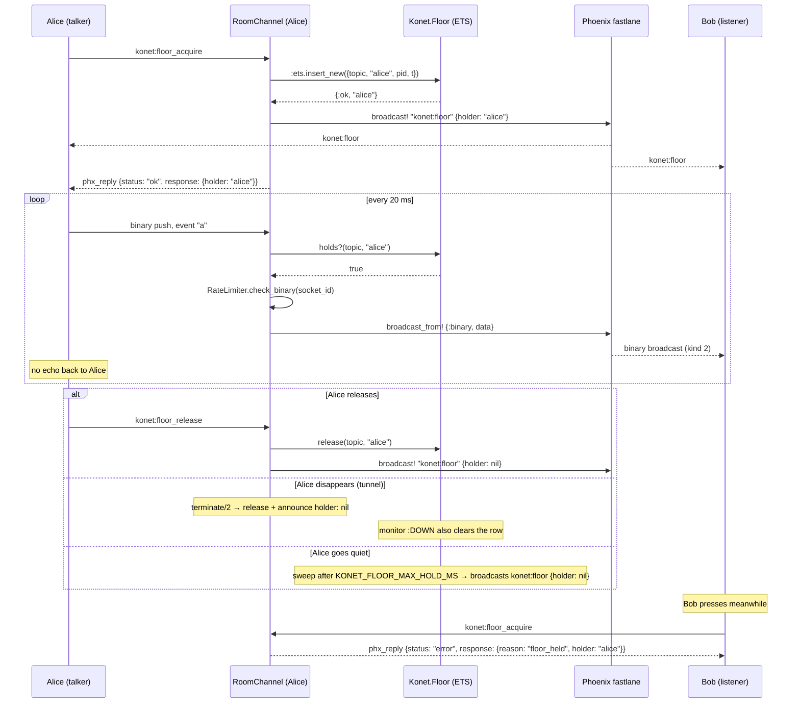

# 02.2 — Binary frames and floor control

Added in commits `3975f19` and `61ce7d9` ("Trames binaires et parole
exclusive"). Two features that only make sense together: the binary path is the
transport, the floor is the arbiter that says who may use it.

## Why they exist

The target workload is half-duplex media — push-to-talk, a radio net, a
turn-based game — where the point is that a **second sender must be told no**
rather than mixed in. Konet stays generic: it arbitrates who may send, it does
not know what is being sent. Nothing in the server mentions audio, Opus or
codecs.

## Binary modes: `Konet.BinaryMode`

The floor was originally unconditional — every binary frame needed it — which
made the transport push-to-talk-only. A call needs both sides to send at once,
so a topic now runs one of two modes, passed as `binary_mode` in the join
payload:

| Mode | Right to send | `Konet.Floor` |
|---|---|---|
| `exclusive` (default) | the floor holder | used as before |
| `multiplex` | every member | **never called** — not acquire, not `holds?`, not release in `terminate/2` |

`lib/konet/binary_mode.ex`. Why the mode is the **topic's**, not the member's:
a push-to-talk client relies on a second sender being refused, a call client on
never being refused; they cannot share a topic. So:

- each member is a row `{topic, pid, mode}` in the `:konet_binary_mode` bag
  (owned by `Konet.Tables`);
- `claim/3` is a `GenServer.call`, so "read the mode in force" and "add this
  member" are one step — two first joiners asking for different modes resolve
  to one winner (pinned by `binary_mode_test.exs`, 40 concurrent claims);
- a joiner asking for the other mode gets
  `{reason: "binary_mode_mismatch", binary_mode: <in force>}`;
- members are **monitored**, never released explicitly: a channel process
  ending is the only way to leave, and the `:DOWN` drops the row. A claim also
  prunes dead pids itself, because a `:DOWN` may still be queued behind it;
- on restart, monitors are rebuilt from the table (same pattern as `Floor`).

An absent `binary_mode` means `exclusive`, so every existing client — and every
text-only client — joins exactly as before. The flip side: **every member of a
multiplex topic must ask for multiplex**, including a text-only observer.

`RoomChannel.join/3` caches the mode in `socket.assigns.binary_mode`. The cache
cannot go stale: the mode changes only once the topic is empty, and a joined
channel is by definition in it. So the multiplex hot path reads no table at all.

The join reply now carries `%{binary_mode: "exclusive" | "multiplex"}` (it was
empty). SDKs read an empty reply — an older server — as `exclusive`.

### Sender prefix (multiplex only)

A broadcast binary frame carries topic, event and data — no sender. In
`exclusive` the floor holder is the sender; in `multiplex` with three or more
members, receivers could not tell streams apart. So in `multiplex` the server
relays `data` as:

```
<<byte_size(user_id)::8, user_id::binary, data::binary>>
```

- Written by the server from `socket.assigns.user_id` (the token's `sub`), so a
  member cannot impersonate another.
- The prefix is built once at join (`socket.assigns.sender_prefix`); the hot
  path only concatenates (`stamp/2`). `exclusive` sockets have `nil` and frames
  pass through untouched — Goule's wire format is unchanged.
- One length byte, like every size in Phoenix's framing: a `user_id` that is
  not a binary or exceeds 255 bytes is refused at a multiplex join with
  `invalid_sender_id`, before the mode is claimed.
- SDKs split it off only when the **confirmed** mode is `multiplex` (an older
  server accepts the join, stays exclusive and stamps nothing), and drop a frame
  too short for its own prefix. JS passes `sender` as the handler's second
  argument; Go has `OnBinaryFrom`, Python `on_binary_from`. The splitter is
  `splitSender` / `splitSender` / `split_sender` in each `binary.*`.

## `Konet.Floor`

`lib/konet/floor.ex`. One ETS row per topic: `{topic, user_id, pid, since_ms}`.

Two properties are handled here rather than by callers:

**Acquisition is atomic.** `:ets.insert_new/2` is a compare-and-swap, and the
ETS table is the only authority. Two clients pressing in the same millisecond
resolve to exactly one winner without a GenServer round trip.

```elixir
def acquire(topic, user_id, pid \\ self()) do
  entry = {topic, user_id, pid, now_ms()}
  if :ets.insert_new(@table, entry) do
    GenServer.cast(__MODULE__, {:monitor, topic, pid})
    {:ok, user_id}
  else
    case holder(topic) do
      ^user_id -> {:ok, user_id}          # duplicate press: harmless
      nil      -> acquire(topic, user_id, pid)  # released between the two calls
      other    -> {:error, {:held, other}}
    end
  end
end
```

**The floor is always released**, through three independent mechanisms:

1. `RoomChannel.terminate/2` calls `Floor.release/2` explicitly and announces
   `konet:floor` with `holder: nil`, so other clients stop showing someone as
   talking.
2. `Konet.Floor` monitors the holder's pid. On `:DOWN` it reads the row with
   `:ets.match_object(@table, {topic, :_, pid, :_, :_})` and deletes it —
   matching on the pid too, because by then the topic may legitimately belong
   to someone else.
3. A sweep every 5 s deletes any row older than `KONET_FLOOR_MAX_HOLD_MS`
   (default 30 s), for a holder who simply stops talking without releasing.

Paths 2 and 3 also **announce** `konet:floor` with `holder: nil`, through
`KonetWeb.Endpoint.broadcast/3` since `Konet.Floor` has no socket. They used to
delete the row silently: listeners kept showing the holder as talking until
someone else pressed, and the holder learnt nothing — the `floor_required`
reply to its next frame is one no SDK tracks. The announcement reaches the
holder too. Path 1 needs no second announcement: once `terminate/2` has
released, the `:DOWN` finds no row. Pinned by
`describe "releases decided by the arbiter are announced"` in `floor_test.exs`.

`release/2` is holder-checked: a late release from a previous holder must not
cut off whoever is talking now.

**Retries are bounded.** The retry taken when a holder releases between the
`insert_new` and the read is capped at `@max_acquire_attempts` (5), after which
`acquire` reports the current holder. Unbounded recursion there could in
principle spin forever under contention.

**Two clocks, both deliberate.** Each row stores a monotonic timestamp *and* a
wall-clock one, because they answer different questions: the sweep measures
elapsed hold time against the monotonic value, and the wire carries the
wall-clock one, since a client cannot interpret this node's monotonic clock.
`acquire/3` returns `{:ok, holder, since_wall}` and `RoomChannel` broadcasts that
value rather than "now" — so a duplicate press reports the *original* moment,
which is what a listener joining mid-stream needs to show how long someone has
been talking.

**One monitor per topic, dropped on release.** `release/2` and the sweep both
cast a `:demonitor`, and re-acquiring replaces the previous holder's monitor.
Before that, a channel pressing and releasing repeatedly accumulated one monitor
per press on its own pid.

## Floor protocol

Two client events, one server broadcast. In `multiplex` mode both events are
refused with `{reason: "floor_disabled", binary_mode: "multiplex"}` by a clause
placed before them, and `konet:floor` is never broadcast.

| Direction | Event | Payload | Reply |
|---|---|---|---|
| client → server | `konet:floor_acquire` | `{}` | `{:ok, %{holder: user_id}}` or `{:error, %{reason: "floor_held", holder: other}}` |
| client → server | `konet:floor_release` | `{}` | `:ok` or `{:error, %{reason: "not_holder"}}` |
| server → all | `konet:floor` | `%{holder: user_id \| nil, since: ms}` | — |

The `konet:floor` broadcast goes to **everyone including the holder**: subscribers
need to know a stream is starting before its first frame arrives, and the holder
sees the same `holder` and `since` as everyone else. Exclusive frames carry no
holder id: the sender is implied by this announcement.

## The binary hot path

```elixir
def handle_in(event, {:binary, data}, socket) do
  if may_send_binary?(socket) do  # true in multiplex; Floor.holds?/2 in exclusive
    case RateLimiter.check_binary(socket.assigns.socket_id) do
      :ok ->
        Metrics.message_sent()
        broadcast_from!(socket, event, {:binary, data})
        {:noreply, socket}
      {:error, :rate_limited} ->
        {:reply, {:error, %{reason: "rate_limited"}}, socket}
    end
  else
    {:reply, {:error, %{reason: "floor_required"}}, socket}
  end
end
```

At 20 ms frames this runs 50 times a second per talker, so it does the least
possible. Three things are deliberately **absent**, each for a stated reason
(the comment block above the clause in `room_channel.ex` is the canonical
version):

- **No history recording** — buffering 50 frames a second would blow up the ETS
  table for a replay nobody can use. Recording audio is a durable-storage
  problem, not a replay-buffer one.
- **No per-frame logging** — this is exactly the hot-path `LogBuffer` write that
  the text path still does, and audio is where it would first hurt.
- **`broadcast_from!`, not `broadcast!`** — sending a talker their own audio back
  is echo, and on a phone it is echo at speaker volume. Pinned by the test
  `"audio is not fed back to the talker"`, which uses `refute_push`.

`broadcast!` with a `{:binary, _}` payload takes Phoenix's **fastlane**: the
frame is encoded once and written to every subscriber's socket without passing
through their channel processes. This is the single biggest reason the server is
Phoenix.

## Binary frames get their own rate budget

`Konet.RateLimiter.check_binary/1` uses key `{:bin, socket_id, second}`,
separate from `{:msg, …}`. Rationale, from `rate_limiter.ex`:

> Binary frames arrive at a media rate, not a message rate: 20 ms Opus frames
> are 50 per second on their own, and sharing the message budget would have a
> sender starve their own non-media events. The budget is per socket: it stops
> one client flooding. In an :exclusive topic the floor also bounds the topic to
> one sender; in a :multiplex topic nothing does, by design.

In multiplex, *n* senders fan out *n × (n − 1)* streams; nothing bounds that
per topic today.

Default `KONET_RATE_LIMIT_BINARY=120`.

## Wire format

The framing is Phoenix's, transcribed from `Phoenix.Socket.V2.JSONSerializer`.
Three shapes, told apart by the first byte:

```
push      0 | join_ref_size | ref_size | topic_size | event_size | … | data
reply     1 | join_ref_size | ref_size | topic_size | status_size | … | data
broadcast 2 | topic_size    | event_size | topic | event | data
```

Every size is one byte, so each field is capped at 255 — checked on encode,
because a silently truncated topic would deliver audio to the wrong room.

The asymmetry is Phoenix's, not Konet's: a **client** push carries a `ref`, a
**server** push does not, and a broadcast carries neither `ref` nor `join_ref`.
That is why every SDK names its decoder `decodeServerFrame` /
`decode_server_frame` / `decodeServerBinaryFrame` — the output of `encodePush`
is deliberately *not* readable by it. A test in each SDK asserts exactly that
("ne lit pas un push client, qui a un format différent").

This table is duplicated in `sdk/js/src/binary.ts`, `sdk/go/binary.go` and
`sdk/python/konet/binary.py`, on purpose: a wire format is the one thing every
client must agree on independently. See [04-sdk/README.md](../04-sdk/README.md).

## Full push-to-talk flow


```mermaid
sequenceDiagram
    participant A as Alice (talker)
    participant Ch as RoomChannel (Alice)
    participant F as Konet.Floor (ETS)
    participant PS as Phoenix fastlane
    participant B as Bob (listener)

    A->>Ch: konet:floor_acquire
    Ch->>F: :ets.insert_new({topic, "alice", pid, t})
    F-->>Ch: {:ok, "alice"}
    Ch->>PS: broadcast! "konet:floor" {holder: "alice"}
    PS-->>A: konet:floor
    PS-->>B: konet:floor
    Ch-->>A: phx_reply {status: "ok", response: {holder: "alice"}}

    loop every 20 ms
        A->>Ch: binary push, event "a"
        Ch->>F: holds?(topic, "alice")
        F-->>Ch: true
        Ch->>Ch: RateLimiter.check_binary(socket_id)
        Ch->>PS: broadcast_from! {:binary, data}
        PS-->>B: binary broadcast (kind 2)
        Note over A: no echo back to Alice
    end

    alt Alice releases
        A->>Ch: konet:floor_release
        Ch->>F: release(topic, "alice")
        Ch->>PS: broadcast! "konet:floor" {holder: nil}
    else Alice disappears (tunnel)
        Note over Ch: terminate/2 → release + announce holder: nil
        Note over F: monitor :DOWN also clears the row
    else Alice goes quiet
        Note over F: sweep after KONET_FLOOR_MAX_HOLD_MS → broadcasts konet:floor {holder: nil}
    end

    Note over B: Bob presses meanwhile
    B->>Ch: konet:floor_acquire
    Ch-->>B: phx_reply {status: "error", response: {reason: "floor_held", holder: "alice"}}
```

## Test coverage

- `describe "binary mode"` / `describe "multiplex"` in `room_channel_test.exs` —
  default and explicit modes, invalid mode, mismatch refusal, mode forgotten
  when the topic empties, floor events refused and `Konet.Floor` never written,
  and **two members sending 30 interleaved frames each**, every member running
  in its own process so the test sees exactly what each socket receives.
- `test/konet/binary_mode_test.exs` — the registry: concurrent first joiners,
  stale rows, crash/restart.
- Sender prefix: the duplex test sends identical payloads from both members and
  tells them apart by prefix only; a 256-byte id is refused; exclusive frames
  are asserted untouched.
- Conformance steps 16–20 run the same multiplex scenario against a real server
  from each SDK.

`test/konet_web/room_channel_test.exs` covers the whole feature:

- `describe "floor control"` — first acquire granted and announced; second
  holder refused with the holder's name; repeated press by the holder is
  harmless; only the holder may release; **the floor frees when the holder's
  channel goes away** (the test unlinks the channel, monitors it, leaves, then
  calls `:sys.get_state(Konet.Floor)` to drain the mailbox so the monitor path
  is exercised and not only the `terminate/2` release).
- `describe "binary frames"` — the holder's frames reach the other subscribers;
  a frame without the floor is refused with `floor_required` **and the channel
  stays usable**; audio is not fed back to the talker.

There is **no server-side test** of the binary wire format itself — the encoding
is Phoenix's, and the SDKs each test their own transcription of it.
