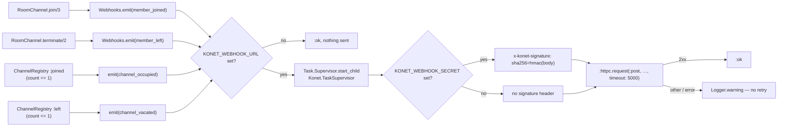

# 02.3 — Auth, rate limiting, webhooks

## JWT — `Konet.Auth`

`lib/konet/auth.ex`, on top of Joken. One algorithm (**HS256**), one secret
(`:jwt_secret`), three kinds of token that differ only by claims:

| Token | Claims | Minted by |
|---|---|---|
| anon key | `{"role": "anon", "iat": …}` | `konet keys generate`, `Auth.rotate!/0`, or by hand |
| service key | `{"role": "service", "iat": …}` | same |
| user token | whatever the developer's backend puts in — typically `sub`, `channels`, `exp` | the developer's own backend, using `KONET_JWT_SECRET` |

There is no token store, no revocation list, no refresh flow. The design
consequence is stated plainly in the Studio UI: *"Anon key, service key, and JWT
secret all come from one shared signing secret — rotating regenerates all three
together. There's no way to invalidate just one of them without the others."*

### Expiry is conditional, on purpose

```elixir
defp token_config do
  Joken.Config.add_claim(%{}, "exp", nil, fn exp, _claims, _context ->
    is_integer(exp) and exp > System.system_time(:second)
  end)
end
```

Joken skips validators for claims absent from the token, so:

- a token that **declares** an expiry is held to it (and a non-integer `exp` is
  rejected — there is a test for `"exp" => "bientôt"`);
- a token that **never declared** one keeps working forever.

That is not laziness. `sign/1` adds only `iat`, so every anon and service key
ever minted has no `exp`, and every existing deployment holds one. Making the
claim mandatory would invalidate all of them on upgrade. Added in commit
`243c6f0`; the reasoning is preserved verbatim in the module comment and in
`test/konet/auth_test.exs`.

### `rotate!/0`

```elixir
def rotate! do
  new_secret = :crypto.strong_rand_bytes(32) |> Base.encode16(case: :lower)
  Application.put_env(:konet, :jwt_secret, new_secret)
  {:ok, anon_key} = sign(%{"role" => "anon"})
  {:ok, service_key} = sign(%{"role" => "service"})
  …
end
```

⚠️ **Fragile — rotation is in-memory only.** The new secret lives in
`Application` env in the running process. It is **lost on restart** unless
copied into `konet.config.toml` or the platform's env vars, at which point every
token issued from the rotated secret stops working. The Studio banner says so,
but nothing enforces it: a rotate followed by a container restart silently
reverts to the old secret, and clients that stored the new anon key are locked
out.

### Studio password

`studio_auth_enabled?/0` returns false when `:studio_password` is unset or
empty — **and an unset password means the Studio has no login at all**, not that
it is inaccessible. `verify_studio_password/1` uses
`Plug.Crypto.secure_compare/2`, so it is constant-time.

## Admin API authentication

`KonetWeb.AdminController.require_service_key/1`:

```elixir
case get_req_header(conn, "authorization") do
  ["Bearer " <> token] ->
    case Auth.verify(token) do
      {:ok, %{"role" => "service"} = claims} -> {:ok, claims}
      _ -> {:halt, send_unauthorized(conn, "invalid or insufficient token")}
    end
  _ -> {:halt, send_unauthorized(conn, "missing Authorization: Bearer <service_key>")}
end
```

Route matrix:

| Route | Auth | Notes |
|---|---|---|
| `GET /` | none | name/version/status JSON banner |
| `GET /api/health` | **none** | used by the Docker `HEALTHCHECK` and by Coolify/Dokploy. Leaks `connections` and `uptime_seconds`. |
| `GET /api/channels` | service key | list of `%{id, subscribers}` |
| `GET /api/presence/:channel` | service key | presence entries for one room |
| `POST /api/broadcast` | service key | `%{channel, event, payload}` |
| `GET /api/metrics` | service key | JSON metrics |
| `GET /metrics` | service key | Prometheus text format |

⚠️ The version string is hardcoded as `"0.1.0"` in three places in
`admin_controller.ex` (`root/2`, `health/2`) and in
`Studio.OverviewLive.render/1`, plus `version: "0.1.0"` in `mix.exs` and
`Version: "0.1.0"` in `konet-cli/cmd/root.go`. Nothing is derived from the git
tag, so `/api/health` reports `0.1.0` on a `v0.2.0` release.

## Rate limiting — `Konet.RateLimiter`

One ETS table, `:konet_rl`, with `write_concurrency`. Three independent budgets,
each a counter keyed by bucket + time window:

| Function | Key | Window | Default | Env var |
|---|---|---|---|---|
| `check_connection/1` | `"conn:#{ip}:#{minute}"` | 1 minute | 200 | `KONET_CONN_RATE_LIMIT` |
| `check_message/1` | `"msg:#{socket_id}:#{second}"` | 1 second | 60 | `KONET_RATE_LIMIT` |
| `check_binary/1` | `"bin:#{socket_id}:#{second}"` | 1 second | 120 | `KONET_RATE_LIMIT_BINARY` |

`:ets.update_counter(@table, key, {2, 1}, {key, 0})` increments and creates the
row atomically in one call — no read-then-write race.

Windows are **fixed**, derived from `System.monotonic_time(:second)` and
`div(…, 60)`. Not a sliding window: a client can send 60 messages at the end of
one second and 60 at the start of the next.

⚠️ **Fragile — cleanup wipes everything.** Every 120 s,
`handle_info(:cleanup, …)` runs `:ets.delete_all_objects(@table)`. Rows are
never expired individually. Two consequences: memory is bounded (good), and
every client's counter resets simultaneously every 2 minutes, briefly allowing a
double budget in the second that straddles the wipe (harmless at these limits,
but it is why the limiter should not be used for anything security-sensitive).

Covered by `test/konet/rate_limiter_test.exs`, which drives the limits through
`Application.put_env/3` — hence `async: false`.

## Webhooks — `Konet.Webhooks`

Disabled unless `KONET_WEBHOOK_URL` is set. Four events:

| Event | Emitted from | When |
|---|---|---|
| `channel_occupied` | `ChannelRegistry.handle_cast({:joined, …})` | subscriber count reaches 1 |
| `channel_vacated` | `ChannelRegistry.handle_cast({:left, …})` | last subscriber leaves |
| `member_joined` | `RoomChannel.join/3` | every successful join |
| `member_left` | `RoomChannel.terminate/2` | every channel teardown |

Body:

```json
{"event": "member_joined", "data": {"room": "lobby", "user": "alice"},
 "timestamp": "2026-08-11T09:00:00.000000Z"}
```

With `KONET_WEBHOOK_SECRET` set, each request carries
`x-konet-signature: sha256=<hex>` — HMAC-SHA256 of the raw body.

Delivery is fire-and-forget from `Konet.TaskSupervisor` using Erlang's built-in
`:httpc` (which is why `:inets` and `:ssl` are in `extra_applications`). A slow
or down receiver never blocks channel operations. **Failures are logged, not
retried** — non-2xx and transport errors both produce a `Logger.warning` and
nothing else.

⚠️ **Fragile — no ordering, no delivery guarantee, no retry.** Each event spawns
its own task, so `member_joined` and `member_left` for the same user can arrive
out of order. Receivers must be idempotent and must not treat webhook order as
authoritative. There is also no timeout on the task itself, only a 5 s
`:httpc` timeout.


