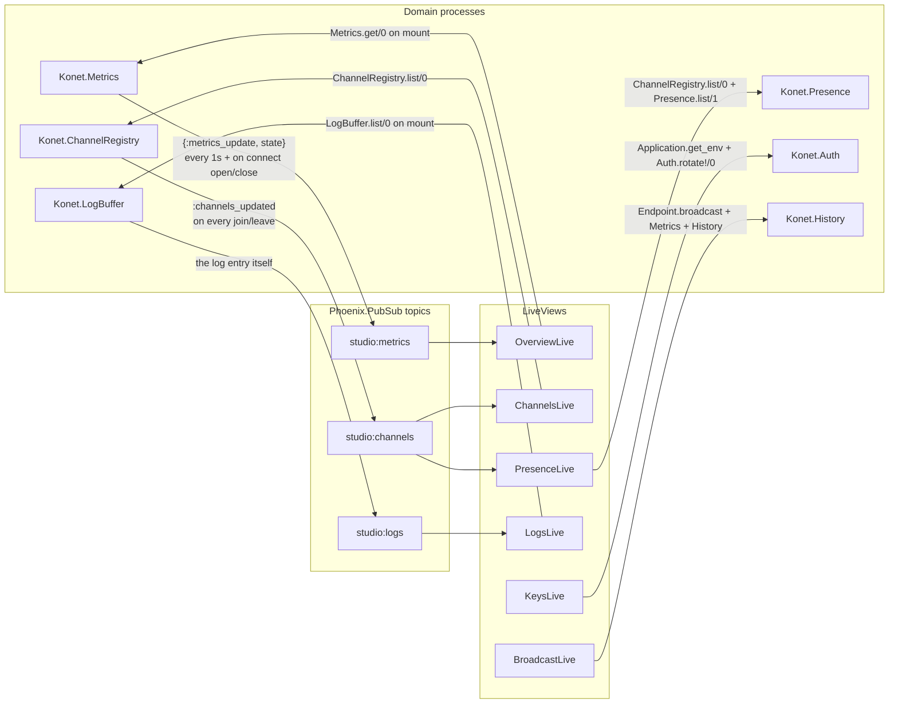

# 02.4 — The Studio (LiveView admin UI)

The Studio is served by the Konet server itself, on the same port. There is no
separate listener — `konet-cli/internal/config/config.go` even carries a comment
explaining why `StudioConfig` deliberately has no port field.

## Routing

`lib/konet_web/router.ex` splits `/studio` into two scopes:

```elixir
scope "/studio", KonetWeb do
  pipe_through :browser
  get  "/login",  StudioAuthController, :new
  post "/login",  StudioAuthController, :create
  post "/logout", StudioAuthController, :delete
end

scope "/studio", KonetWeb do
  pipe_through [:browser, :require_studio_auth]
  live_session :studio, layout: {KonetWeb.Layouts, :studio},
                        on_mount: KonetWeb.Studio.Auth do
    live "/",          Studio.OverviewLive
    live "/overview",  Studio.OverviewLive
    live "/channels",  Studio.ChannelsLive
    live "/presence",  Studio.PresenceLive
    live "/logs",      Studio.LogsLive
    live "/broadcast", Studio.BroadcastLive
    live "/keys",      Studio.KeysLive
  end
end
```

Auth is enforced **twice**, and both are needed:

1. `check_studio_auth/2` — a plug on the HTTP request, redirects to
   `/studio/login` when the session flag is missing. This covers the initial
   page load.
2. `KonetWeb.Studio.Auth.on_mount/4` — runs on the LiveView mount, both the
   static render and the subsequent WebSocket connect. This covers live
   navigation inside `live_session`, which never goes through the plug pipeline
   again.

Both short-circuit on `not Konet.Auth.studio_auth_enabled?()`, so an unset
`KONET_STUDIO_PASSWORD` means **the Studio is fully open**.

The login page is not a template: `StudioAuthController.login_page/1` returns a
here-doc HTML string with an inline CSRF token, sent via `send_resp/3`. It pulls
`/assets/app.css` and a Google Fonts stylesheet.

⚠️ The login page's `<link href="https://fonts.googleapis.com/...">` is the only
outbound network dependency in the whole server. An air-gapped deployment
renders it unstyled-ish but functional.

## How the LiveViews get their data

There is no API layer between the Studio and the rest of the server. Each
LiveView reads the GenServers directly and subscribes to a PubSub topic for
updates.



Per page:

| LiveView | Mount reads | Subscribes to | Actions |
|---|---|---|---|
| `OverviewLive` | `Konet.Metrics.get/0` | `"studio:metrics"` | none — display only |
| `ChannelsLive` | `ChannelRegistry.list/0` | `"studio:channels"` | select a room (detail panel) |
| `PresenceLive` | `build_presence_map/0` (registry × `Presence.list/1`) | `"studio:channels"` | select a user |
| `LogsLive` | `LogBuffer.list/0`, into a **LiveView stream** | `"studio:logs"` | pause, clear |
| `BroadcastLive` | — | — | send a JSON broadcast to `room:<channel>` |
| `KeysLive` | `Application.get_env` + `System.get_env` fallbacks | — | rotate secret, show/hide secret |

Notes on the wiring:

- **`OverviewLive` never polls.** `Konet.Metrics` pushes `{:metrics_update, …}`
  once a second from its `:compute_rate` timer, and additionally on every
  connection open/close via `broadcast_update/1`. That second path deliberately
  does *not* flush the 1-second message window, because doing so would corrupt
  the msg/s rate.
- **`PresenceLive` refreshes on `:channels_updated`**, i.e. on channel
  join/leave. It does **not** subscribe to Phoenix presence diffs, so a presence
  metadata change without a channel count change would not refresh the page.
  In practice presence only changes on join/leave, so this holds — but it is an
  implicit coupling.
- **`LogsLive` uses `stream/3` + `stream_insert(at: 0)`**, which keeps the DOM
  bounded without holding every entry in assigns. It also drops incoming events
  entirely while `paused` (`handle_info(_event, %{assigns: %{paused: true}})`),
  so pausing loses entries rather than buffering them.
- **`BroadcastLive` mirrors `AdminController.broadcast/2`**: same
  `Endpoint.broadcast("room:#{channel}", event, payload)`, same
  `Metrics.message_sent()`, same `History.record/3`. Two copies of the same
  three-line sequence — a small piece of duplication worth knowing about if you
  change broadcast semantics.
- **`KeysLive` falls back to `System.get_env/1`** when
  `Application.get_env(:konet, :anon_key)` is nil, which matters in `:dev` where
  `runtime.exs` never reads `KONET_ANON_KEY`.

## Key rotation from the Studio

`KeysLive.handle_event("rotate", …)` calls `Konet.Auth.rotate!/0` and re-renders
with the new values. The button carries
`data-confirm="Rotate the JWT secret? Every anon/service key issued so far will
stop working immediately."` and the success banner tells the operator to copy
the values out.

⚠️ This is the single most dangerous button in the product, and its effect is
not persisted (see
[03-auth-ratelimit-webhooks.md](03-auth-ratelimit-webhooks.md#rotate0)). It
invalidates every live client's token instantly, and a restart before the
operator copies the values reverts to the old secret — leaving clients that
saved the new key permanently locked out.

## Assets

`assets/js/app.js` is 12 lines: it creates a `LiveSocket` on `/live` with
`longPollFallbackMs: 2500` and the CSRF token. Everything else is
`assets/css/app.css`. esbuild bundles them into `priv/static/assets/`
(`mix assets.build` in dev, `mix assets.deploy` — minify + `phx.digest` — in the
Docker build).

`priv/static/assets/` is gitignored, so a fresh clone has no CSS until
`mix assets.build` runs. `mix setup` does it for you.

## Layouts

`lib/konet_web/components/layouts/` holds `root.html.heex`, `app.html.heex` and
`studio.html.heex`. The Studio pages use `layout: {KonetWeb.Layouts, :studio}`,
set once on `live_session`. `KonetWeb.StudioComponents` is imported into every
LiveView through the `html_helpers` block in `lib/konet_web.ex`.
