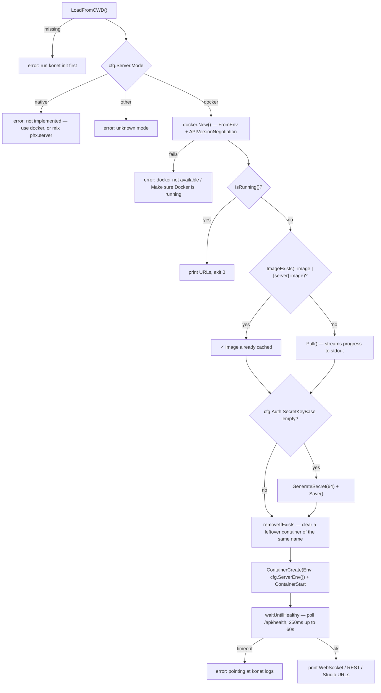

# 03.0 — Command structure

## The tree

`cmd/root.go` registers eleven commands on `rootCmd` (`Use: "konet"`). Its
`Version` defaults to `"dev"` and is replaced at startup by `cmd.SetVersion`,
which `main` calls with the value GoReleaser stamps in:

```
konet
├── init                      write konet.config.toml
├── keys
│   └── generate              mint anon_key + service_key from jwt_secret
├── start                     pull + run the Docker container
├── stop                      stop + remove the container
├── status                    container state + GET /api/health + /api/metrics
├── logs [-f|--follow]        stream container logs
├── channels
│   └── list                  GET /api/channels
├── presence <channel>        GET /api/presence/:channel
├── publish <channel> <json>  POST /api/broadcast   [-e|--event, default "message"]
├── studio                    open the Studio URL in the browser
└── upgrade                   self-update + pull the server image
```

Only `keys` and `channels` have subcommands; both are bare parents that do
nothing on their own.

## `konet.config.toml`

Written by `init`, read by every command that needs config
(`config.LoadFromCWD()`). Structure from `internal/config/config.go`:

```toml
[server]
host = "localhost"
port = 4000
mode = "docker"          # "native" is rejected at runtime
image = "ghcr.io/raucheacho/konet:latest"
allowed_origins = "*"

[auth]
anon_key = ""            # filled by `konet keys generate`
service_key = ""
jwt_secret = "<64 hex chars, generated at init>"
secret_key_base = "<64 hex chars, generated at init>"

[studio]
password = ""            # empty disables the Studio login

[limits]                 # 0 = leave the server's own default alone
messages_per_second = 0
connections_per_minute = 0
binary_per_second = 0

[history]
limit = 0                # 0 disables replay
ttl_seconds = 0

[webhooks]
url = ""
secret = ""
```

Notes that matter:

- **`secret_key_base` is generated at `init`** by `config.GenerateSecret(64)`
  (32 random bytes, hex-encoded — so 64 characters, not 64 bytes). It is
  persisted so the Studio session cookie survives container restarts.
  `start` back-fills it for configs written before that field existed.
- **`jwt_secret` is generated too.** `init` used to write the documented
  placeholder, so `konet init && konet keys generate && konet start` produced a
  working but **publicly-known** signing secret. It is now 32 random bytes.
  `keys generate` still warns if you hand-edit the placeholder back in, and now
  refuses outright on an empty secret.
- **The keys start empty, not as placeholders.** They used to default to
  `kt_anon_xxx…`, which is not a JWT — a server started before `keys generate`
  received a token it could only reject, surfacing as an unexplained
  "unauthorized" at connect time. `konet start` now warns when they are empty.
- **`[limits]`, `[history]`, `[webhooks]` and `[server].allowed_origins` are new.**
  They exist so a local run can reproduce a production configuration; before,
  those knobs were unreachable from the CLI at any price.
- `StudioConfig` has no port field, and the comment above it explains why: the
  Studio is served by the server on the server port.
- The file is in the repo's `.gitignore` (twice, in fact — under the Go section
  and under the secrets section).

`Save` uses `toml.NewEncoder`, which rewrites the whole file — comments and key
order you added by hand are lost whenever `keys generate` or `start` writes
back.

## Command by command

### `init` (`cmd/init.go`)

Idempotent: if `konet.config.toml` exists it prints `✓ … already exists` and
returns. Otherwise writes `config.Default()` — generating `jwt_secret` and
`secret_key_base` — and prints the next steps plus a warning that the file now
holds a real signing secret and belongs out of version control.

### `keys generate` (`cmd/keys.go`)

Signs two HS256 JWTs with `cfg.Auth.JWTSecret` and writes them back into the
config.

**The JWT implementation is hand-rolled**, ~30 lines: `signJWT`,
`base64URLEncode` (base64url with `=` stripped), `hmacSHA256`. No library.

```go
header  := base64URLEncode(`{"alg":"HS256","typ":"JWT"}`)
claims["iat"] = time.Now().Unix()
payload := base64URLEncode(string(claimsJSON))
sig     := hmacSHA256(header+"."+payload, secret)
```

This must stay byte-compatible with Joken's HS256 verification on the server.
`cmd/keys_test.go` now pins it, stating the JWT wire format independently rather
than agreeing with whatever `signJWT` emits: three base64url segments with no
padding, `alg: HS256`, an `iat` and deliberately no `exp`, and a signature
recomputed from `crypto/hmac` directly. It had no test at all before, so a change
to claim ordering or padding would have broken every generated key silently.

The claims are `{"role": "anon"}` and `{"role": "service"}` plus `iat`. No `exp`
— consistent with `Konet.Auth.sign/1`, and the reason the server's expiry check
is conditional.

### `start` (`cmd/start.go`)



**Readiness is polled, not slept.** `waitUntilHealthy` calls `/api/health` every
250 ms for up to 60 s, then fails with a message pointing at `konet logs`. It
used to be a flat `time.Sleep(20 * time.Second)`, which wasted most of that on a
fast machine and could still report success too early on a slow one.

**The container environment comes from the config file.**
`Config.ServerEnv()` builds it, so everything `runtime.exs` reads is reachable —
including `KONET_HISTORY_LIMIT`, which `examples/live-room` needs for its chat
backlog and which used to require bypassing the CLI entirely. Zero values in
`[limits]` are omitted rather than passed as `0`, so the server keeps its own
defaults unless you actually set one.

**The image is overridable** through `[server].image` or `--image`, which is what
lets the CLI exercise a locally built server.

### `stop` (`cmd/stop.go`)

`ContainerStop` with a 15 s timeout, then `ContainerRemove`. The container is
removed, not just stopped, so `start` always creates a fresh one — which is why
in-memory state never survives a `stop`/`start` cycle.

`start` also clears a leftover container of the same name (`removeIfExists`)
before creating one, so a container that crashed or was stopped outside the CLI
no longer causes a name conflict whose error message never mentions
`docker rm konet-server`.

### `status` (`cmd/status.go`)

The only command that tolerates every failure: no Docker, no config and an
unreachable server all print a line and return `nil`. Calls `Health()` (no
auth) then `Metrics()` (service key); a failing `Metrics()` is silently skipped,
so a bad `service_key` shows as "no metrics" rather than an auth error.

### `logs` (`cmd/logs.go`)

`ContainerLogs` with `Tail: "100"`, `Timestamps: true`, `Follow: logsFollow`,
demultiplexed through `stdcopy.StdCopy` into stdout and stderr.

Two fixes live here. The stream used to be `io.Copy`'d raw, so Docker's 8-byte
per-frame header (present whenever the container has no TTY) printed inline with
the log lines. And the command carried a dead `if logsFollow { ctx =
context.Background() }` whose branches were identical — the cancellable context
it hinted at is now the command's own, so Ctrl+C ends a `--follow` stream
cleanly.

### `channels list` / `publish`

Thin wrappers over `internal/api`. `channels list` prints a fixed-width table
and re-adds the `room:` prefix for display (`fmt.Sprintf("room:%v", m["id"])`),
matching how the server stores bare room ids. `publish` validates the payload is
JSON client-side before sending.

### `studio` (`cmd/studio.go`)

Prints `cfg.StudioURL()` (`http://<host>:<port>/studio`) and shells out to
`open` / `xdg-open` / `rundll32` depending on `runtime.GOOS`.

### `upgrade` (`cmd/upgrade.go`)

Compares `"v" + rootCmd.Version` against the GitHub API's
`releases/latest.tag_name`, then downloads and runs an install script.

**It no longer replaces a binary it does not own.** `detectInstallMethod`
resolves the executable's path through symlinks and classifies it; on a Homebrew
or Scoop install the command prints the right upgrade line and stops. That
classification runs *before* the version check, so an unreachable release API
still yields useful advice rather than an error. Only an unmanaged install —
`install.sh`, or a hand-extracted archive — takes the self-update path.

This command was also broken three ways, all fixed:

1. **The version is real.** `main.go` declares `var version = "dev"` and passes
   it to `cmd.SetVersion`, so GoReleaser's `-X main.version` finally lands — the
   linker silently ignores `-X` for a symbol that does not exist, so every
   released binary used to report the hardcoded `0.1.0` and `upgrade` always
   believed an update was available. A `dev` build now says so and skips
   self-update rather than comparing a fake version.
2. **The download is checked.** `httpGet` rejects any non-2xx status and
   `downloadScript` rejects a body that does not begin like a shell script.
   Previously only transport errors were caught, so GitHub's 404 HTML page for
   the (still non-existent) `install.sh` was handed straight to `sh`.
3. **The fallback URLs are valid** (`github.com/raucheacho/konet/releases/latest`).

⚠️ `install.sh` still does not exist in this repo, so the auto-update path always
takes the fallback. That is now a clear message instead of an executed error
page, but adding the script — or dropping the command — is still open.
