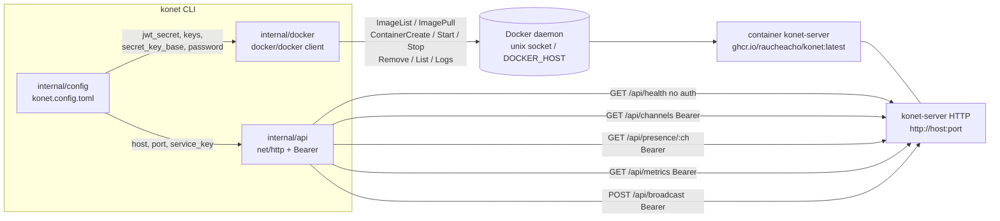

# 03.1 — How the CLI talks to konet-server

Two independent channels, and they never overlap: **the Docker daemon** for
lifecycle, **HTTP** for state.



## Docker path — `internal/docker/docker.go`

```go
const (
    ImageName     = "ghcr.io/raucheacho/konet:latest"
    ContainerName = "konet-server"
)
```

**Finding the daemon takes more than `FromEnv`.** That option reads
`DOCKER_HOST` and otherwise assumes `/var/run/docker.sock`; it does **not** read
Docker CLI contexts. On a stock Docker Desktop install for macOS that socket
does not exist — the daemon listens on `~/.docker/run/docker.sock` — so every
Docker-touching command failed with "Is the docker daemon running?" while the
daemon was running. Colima and rootless Linux move it as well.

`New()` therefore honours `DOCKER_HOST` when it is set, and otherwise probes,
in order:

1. `~/.docker/run/docker.sock` — Docker Desktop
2. `~/.colima/default/docker.sock` — Colima
3. `$XDG_RUNTIME_DIR/docker.sock` — rootless Docker on Linux
4. `/var/run/docker.sock` — the classic location, last resort

Each candidate is **pinged**, not just constructed: `NewClientWithOpts` never
fails on its own, so a client pointed at a dead socket looks fine until the
first real call. The error lists everything tried and suggests
`DOCKER_HOST=$(docker context inspect --format '{{.Endpoints.docker.Host}}')`.

`WithAPIVersionNegotiation()` is kept so the client works across daemon
versions.

| Method | Docker API call | Notes |
|---|---|---|
| `ImageExists` | `ImageList` + `slices.Contains(im.RepoTags, img)` | exact tag match — how a locally built image tagged the same is found without pulling |
| `Pull` | `ImagePull` + `io.Copy(os.Stdout, out)` | raw JSON progress stream is dumped to the terminal |
| `Start` | `ContainerCreate` + `ContainerStart` | env vars, port binding, `RestartPolicy: unless-stopped` |
| `Stop` | `ContainerStop(timeout 15s)` + `ContainerRemove` | container is destroyed, not kept |
| `removeIfExists` | `find` + stop + `ContainerRemove` | called by `Start`, clears a leftover container of the same name |
| `find` | `ContainerList(All: true)` filtered by name | exact-name match — the API filter is a substring match, so `konet-server-2` matched too |
| `IsRunning` | `find` | `State == "running"` plus the short id |
| `Logs` | `ContainerLogs` + `stdcopy.StdCopy` | `Tail: "100"`, `Timestamps: true`, demultiplexed |

Container configuration built by `Start`. The environment comes from
`config.Config.ServerEnv()`, so every variable `runtime.exs` reads is reachable
from `konet.config.toml`:

```go
Env: cfg.ServerEnv()   // MIX_ENV, PHX_SERVER, KONET_HOST, KONET_PORT,
                       // KONET_JWT_SECRET, SECRET_KEY_BASE, the keys, the
                       // Studio password, origins, limits, history, webhooks
PortBindings: {"<port>/tcp": [{HostIP: "0.0.0.0", HostPort: "<port>"}]}
RestartPolicy: unless-stopped
```

Three things to know:

- **`KONET_PORT` is used for both sides of the binding.** `nat.Port(portStr + "/tcp")`
  is the *container* port and `HostPort: portStr` is the host port, so setting
  `port = 5000` makes the server listen on 5000 inside the container too. That
  works because `runtime.exs` reads `KONET_PORT`, but it means host and
  container ports can never differ.
- **`HostIP: "0.0.0.0"`** publishes the dev server on every interface, not just
  loopback. On a laptop on a café network, with `KONET_STUDIO_PASSWORD` empty by
  default, the Studio is open to the LAN.
- **`RestartPolicy: unless-stopped`** means the container comes back after a
  reboot even though it was started by a dev CLI. `konet stop` removes it, so
  that is the way to actually get rid of it.

**Name conflicts are handled.** `Start` calls `removeIfExists` first, so a
container that crashed or was stopped outside the CLI is cleared rather than
producing a `container start failed: …` error that never mentions
`docker rm konet-server`. Nothing is lost: the server keeps all its state in
memory anyway.

## HTTP path — `internal/api/client.go`

A 60-line `net/http` wrapper with a 10-second timeout.

```go
func New(baseURL, serviceKey string) *Client
func (c *Client) Health() (map[string]any, error)                 // no auth
func (c *Client) Channels() (map[string]any, error)               // Bearer
func (c *Client) Presence(channel string) (map[string]any, error) // Bearer
func (c *Client) Metrics() (map[string]any, error)                // Bearer
func (c *Client) Broadcast(channel, event string, payload map[string]any)
```

The base URL comes from `cfg.ServerBaseURL()` = `http://<host>:<port>` — always
`http`, never `https`. That is fine for the CLI's local-only scope, but it means
the CLI cannot be pointed at a deployed instance over TLS.

`decodeJSON` reads the whole body, unmarshals, and *then* checks the status
code — so a non-JSON error page produces `invalid JSON response: <html>…`
rather than the status. Everything the server returns is JSON, including its
401s, so in practice you get `server error 401: {"error":"missing Authorization: Bearer <service_key>"}`.

`Presence()` is wired to `konet presence <channel>`. It was implemented and
unreachable for a while.

## Generated and read files

| File | Written by | Read by | Tracked? |
|---|---|---|---|
| `konet.config.toml` | `init`, `keys generate`, `start` (secret back-fill) | every command except `stop`/`logs` | gitignored |
| container `konet-server` | `start` | `stop`, `status`, `logs` | — |
| `$TMPDIR/konet-install-*.sh` | `upgrade` | executed then removed | — |

The CLI writes nothing else — no state directory, no cache, no `~/.konet`.
Everything is either in the config file next to your project or in Docker.

## What the CLI cannot do

Worth stating explicitly, because these gaps come up repeatedly:

- **Point at a remote server.** No `--url` flag; the URL is always derived from
  `[server] host/port` over plain HTTP, which suits the CLI's local-only scope
  but means it cannot drive a deployed instance over TLS.
- **Run without Docker.** `mode = "native"` is rejected with a message pointing
  at `mix phx.server`.

Both of the other long-standing gaps are closed: the image is overridable
(`[server].image` / `--image`), and the full server environment is expressible
in `konet.config.toml`.
