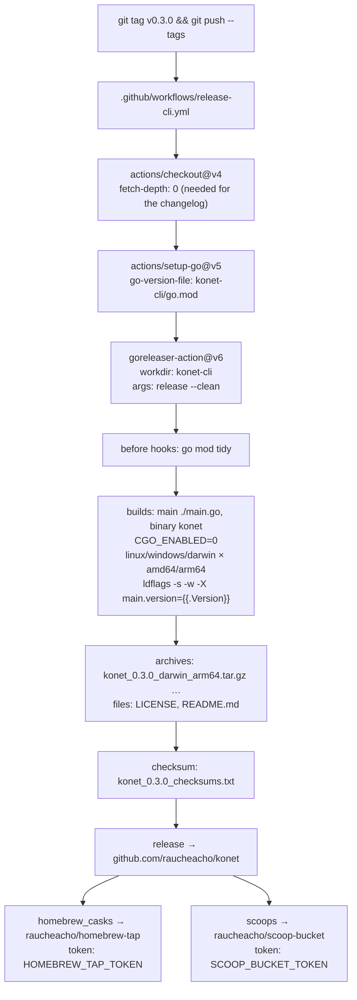

# 03.2 — Release pipeline (GoReleaser)

## One tag releases everything

All six release workflows trigger on the same pattern:

```yaml
on:
  push:
    tags:
      - "v*"
```

| Workflow | Publishes | Where |
|---|---|---|
| `release-cli.yml` | CLI binaries, Homebrew cask, Scoop manifest | GitHub Releases + `raucheacho/homebrew-tap` + `raucheacho/scoop-bucket` |
| `release-server.yml` | Docker image, multi-arch | `ghcr.io/raucheacho/konet` |
| `release-sdk-js.yml` | `@raucheacho/konet-js` | npm |
| `release-sdk-rn.yml` | `@raucheacho/konet-rn` | npm |
| `release-sdk-python.yml` | `konet` | PyPI (trusted publishing) |
| `release-sdk-go.yml` | `sdk/go/vX.Y.Z` tag | the Go module proxy |

So `git tag v0.3.0 && git push origin v0.3.0` publishes **seven artifacts in
parallel**, all sharing one version number. That is deliberate — see
`sdk/react-native/README.md`: *"Konet releases every package in lockstep from a
single git tag, so install both at the same version."* It is also why the RN
peer range is `>=0.3.0` rather than `^0.3.0`.

Consequence: the `version` fields committed in `sdk/js/package.json` (`0.1.0`),
`sdk/react-native/package.json` (`0.1.0`) and `sdk/python/pyproject.toml`
(`0.1.0`) are **meaningless in the repo** — each workflow rewrites them from the
tag before building. Do not trust them when reading the source.

The server is no longer in that category: `mix.exs` reads `KONET_VERSION`, the
image build receives it as a build arg, and `Konet.Version.current/0` reports it
on `/api/health` and in the Studio.

## The CLI flow, end to end



Required repository secrets: `HOMEBREW_TAP_TOKEN`, `SCOOP_BUCKET_TOKEN`
(`GITHUB_TOKEN` is provided automatically). These were renamed in commit
`2a320d1` from `TAP_GITHUB_TOKEN` / `SCOOP_BUCKET_GITHUB_TOKEN`, and the tokens
must have write access to the *tap* and *bucket* repositories, not to `konet`.

Result: 6 binaries (3 OSes × 2 architectures), a checksums file,
`brew install raucheacho/tap/konet` and the Scoop bucket entry.

## Two monorepo traps, both fixed

### Fixed: `../LICENSE` in the archives

GoReleaser runs with `workdir: konet-cli`, so its working directory is the CLI
subdirectory, not the repo root. The original config tried to reach up:

```yaml
files:
  - src: ../LICENSE
  - src: ../README.md
```

GoReleaser refuses paths outside its working directory — archive contents must
be relative to it. The fix (commit `dc4d834`) was to **copy** `LICENSE` and
`README.md` into `konet-cli/` and reference them plainly:

```yaml
files:
  - LICENSE
  - README.md
```

They are still duplicates, but no longer unsynchronised: the `cli-docs-in-sync`
job in `ci.yml` diffs both against the root copies and fails with the exact `cp`
command to run. The CLI README had drifted far enough to still advertise three
SDKs (no React Native) and to omit binary frames and floor control entirely —
and that stale copy shipped inside every release archive.

### Fixed: `format_overrides` was two entries instead of one

```yaml
# before — two list items: the first names no format, the second no goos
format_overrides:
  - goos: windows
  - formats: [zip]

# after
format_overrides:
  - goos: windows
    formats: [zip]
```

Introduced by the same commit `dc4d834` that migrated to GoReleaser v2 field
names (`format` → `formats`, `brews` → `homebrew_casks`, `folder` →
`directory`). Net effect while it lasted: Windows users got a `.tar.gz`, which is
exactly what the Scoop manifest and hand-downloads do not expect.

## The version ldflag — fixed

```yaml
ldflags:
  - -s -w -X main.version={{.Version}}
```

`-X main.version` sets a package-level variable named `version` in `package
main`. `main.go` had none, and Go's linker silently ignores `-X` for a symbol it
cannot find — so the flag did nothing and the version came from a literal in
`cmd/root.go` (`Version: "0.1.0"`). Every released binary reported `0.1.0`, and
`konet upgrade` compared that against the latest tag and always concluded an
update was available.

`main.go` now declares the variable and hands it over:

```go
var version = "dev"

func main() {
    cmd.SetVersion(version)
    cmd.Execute()
}
```

Verified: `go build -ldflags "-X main.version=0.3.0"` produces a binary that
reports `konet version 0.3.0`. An unstamped build reports `dev`, and `upgrade`
recognises that and offers the releases page instead of pretending to compare.

## Server image release

`release-server.yml` is the one non-GoReleaser release:

- `docker/setup-qemu-action` + `setup-buildx-action` for cross-building;
- `platforms: linux/amd64,linux/arm64`;
- `docker/metadata-action` tags: `{{version}}`, `{{major}}.{{minor}}`, and
  `latest` (twice — once for the default branch, once for `v*` tags);
- `build-args: KONET_VERSION=${{ steps.meta.outputs.version }}`, which is what
  makes `/api/health` and the Studio report the real tag. `meta.outputs.version`
  is the semver form (`0.3.0`), not the raw ref (`v0.3.0`) — mix rejects the
  leading `v`;
- GHA layer cache (`cache-from`/`cache-to: type=gha,mode=max`);
- `context: konet-server`, so it builds `konet-server/Dockerfile` directly and
  ignores `docker-compose.yml`.

The QEMU cross-build required a workaround in the Dockerfile (commit `4d891e5`):

```dockerfile
# BEAM's JIT dual-maps code memory, which QEMU can't emulate — single-map it
# so cross-platform image builds (CI building arm64 on amd64) don't crash.
ENV ERL_FLAGS="+JMsingle true"
```

Without it, the arm64 build crashes during `mix compile` under emulation. The
flag is set only in the **builder** stage, so it does not affect runtime
performance of the released image.

## Go SDK release: tag-of-a-tag

`release-sdk-go.yml` cannot publish anywhere — Go modules are served from the
VCS. So it derives a second tag from the first:

```bash
set -euo pipefail
TAG="sdk/go/v${VERSION}"      # from v0.3.0 → sdk/go/v0.3.0
if git ls-remote --exit-code --tags origin "refs/tags/$TAG" >/dev/null 2>&1; then
  echo "Tag $TAG is already published — nothing to do."; exit 0
fi
git tag "$TAG"
git push origin "$TAG"
```

That is the layout the Go module proxy requires for a module in a subdirectory
(`module github.com/raucheacho/konet/sdk/go` needs the tag prefix `sdk/go/`). A
re-run is a no-op thanks to the `ls-remote` check, while a genuine push failure
(permissions, protected tags) fails the job. Both commands used to end in
`|| echo`, which left the job green with nothing published.

## Releasing, in practice

1. Land everything on `main`.
2. Decide the version. It applies to **all** packages, whether or not they
   changed.
3. `git tag vX.Y.Z && git push origin vX.Y.Z`.
4. Watch six workflows. `release-sdk-js` and `release-sdk-rn` race by design —
   the RN build marks the core external and resolves it from the sibling source
   (`tsconfig` `paths`), so it never needs the core to be on npm first.
5. Check the GitHub release page for the CLI archives and checksums.
6. Bump nothing in the repo afterwards — the JS, RN and Python version fields
   stay at their stale values on purpose; the server derives its own from the
   tag at build time.
